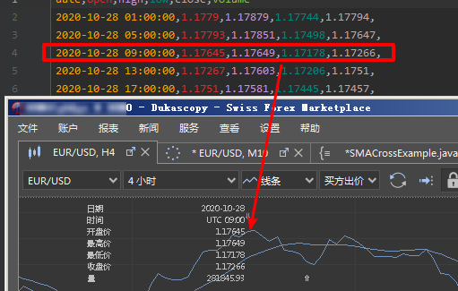
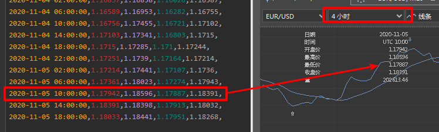

# duka_downloader

dukascopy历史数据下载器，修复了网上其他下载器存在的很多问题，比如夏令时。下载器生成的数据基本和jforex的数据对应上。  


## 自动调整夏令时时间：
 
夏令时未开始，4小时分割呈现奇数  


夏令时开始，4小时分割呈现偶数  


## 基本用法
使用本地的bi5文件，如果没有就下载，然后保存在本地
```.shell script
#./download_from_dukascopy.py -c 4h eurusd 2020-10-28 2020-11-04 -s e:\data
loading: e:\data\EURUSD\2020\09\28\01h_ticks.bi5
loading: e:\data\EURUSD\2020\09\28\02h_ticks.bi5
loading: e:\data\EURUSD\2020\09\28\03h_ticks.bi5
loading: e:\data\EURUSD\2020\09\28\04h_ticks.bi5
loading: e:\data\EURUSD\2020\09\28\05h_ticks.bi5
loading: e:\data\EURUSD\2020\09\28\06h_ticks.bi5
.............
loading: e:\data\EURUSD\2020\10\05\16h_ticks.bi5
loading: e:\data\EURUSD\2020\10\05\17h_ticks.bi5
loading: e:\data\EURUSD\2020\10\05\18h_ticks.bi5
loading: e:\data\EURUSD\2020\10\05\19h_ticks.bi5
loading: e:\data\EURUSD\2020\10\05\20h_ticks.bi5
loading: e:\data\EURUSD\2020\10\05\21h_ticks.bi5
end...........

```
